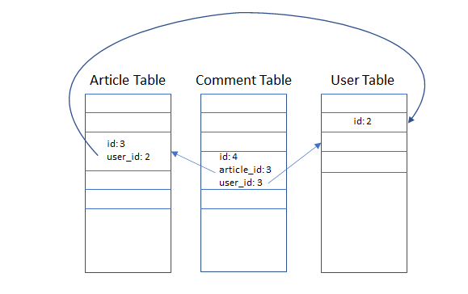
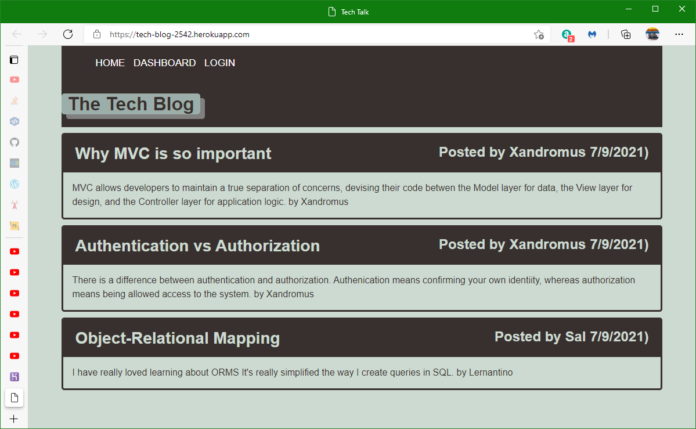
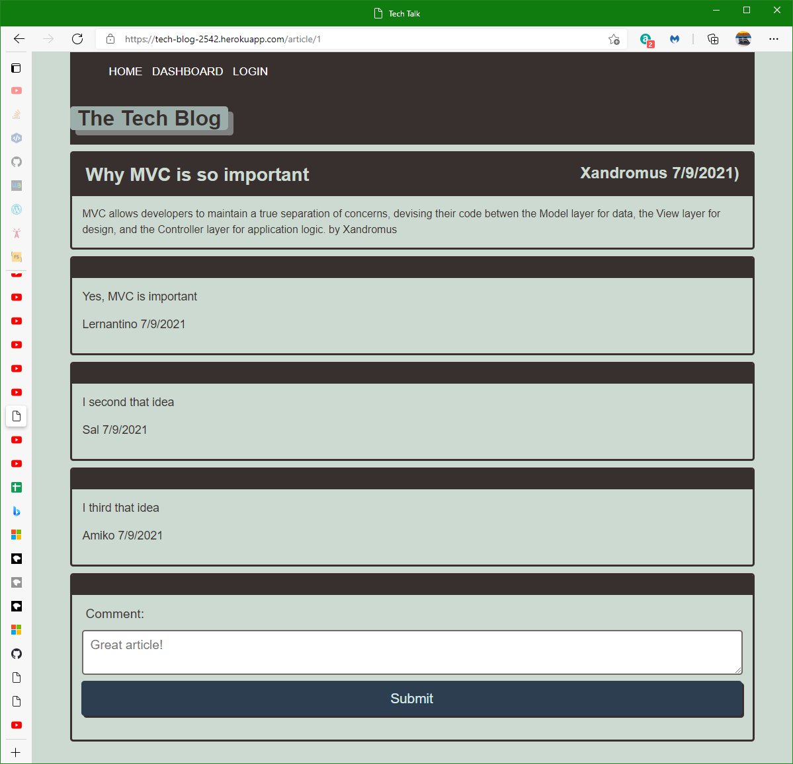

# 14-Tech-Blog
## Description
MVC Node Express Server hosting multiple a group blog

## Usage
The following commands deploy to Heroku. Note that the Heroku CLI has to be installed on the PC with source code for this project.  
`heroku create`
`git push heroku main`

This server/backend works with mySQL on the PC used for development or on Heroku.

To seed the database on the development PC use one of the following commands  
`node seeds/index.js`  
`npm start seeds/index.js`

To seed the database on Heroku use this command  
`heroku run node seeds/seed.js`

To start this server on Heroku, click the Start App button in the page f
https://coding-boot-camp.github.io/full-stack/heroku/deploy-with-heroku-and-mysql

https://coding-boot-camp.github.io/full-stack/heroku/heroku-deployment-guide
1. Create Heroku app with Heroku CLI. The app will have a random name. `heroku create`
https://tech-blog-2542.herokuapp.com


2. check with git remote -v
heroku  https://git.heroku.com/tech-blog-2542.git (fetch)
heroku  https://git.heroku.com/tech-blog-2542.git (push)
origin  git@github.com:minprocess/14-Tech-Blog.git (fetch)
origin  git@github.com:minprocess/14-Tech-Blog.git (push)
3. Add commit push to heroku
````
git add -A
git commit -m "Pushing to Heroku"
git push heroku main
````
<br>
<br>


<br>
<br>  

  
<br>
<br>


<br>
<br>

  
